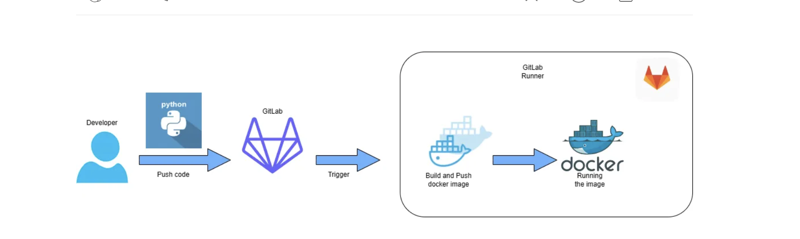

# Python App with GitLab CI/CD and Docker

This project demonstrates how to build, containerize, and deploy a simple Python Flask application using **GitLab CI/CD** and **Docker**.  
The pipeline builds a Docker image, pushes it to **DockerHub**, and deploys it to a container.


---

## Prerequisites

- A VM server with **Docker** installed
- **GitLab** account
- **DockerHub** account

---

## Project Setup

### 1. Build Simple Python Project

Create a file `app.py`:

```python
from flask import Flask
import os

app = Flask(__name__)

@app.route("/")
def skill():
    message = " Hi {name}! this is a simple Gitlab project"
    return message.format(name=os.getenv("NAME", "Sawsan Salah"))

if __name__ == "__main__":
    app.run(host='0.0.0.0', port=3001)
```

This exposes a simple endpoint at **port 3001**.

---

### 2. Create Dockerfile

```dockerfile
FROM python:3.8.0-slim
WORKDIR /app
ADD . /app
RUN pip install --trusted-host pypi.python.org Flask
ENV NAME Sawsan
CMD ["python", "app.py"]
```

This builds a lightweight image based on `python:3.8.0-slim`.

---

## Preparing GitLab Runner

Runners are responsible for executing pipelines. GitLab supports:

- **Shared runners** – accessible by all projects
- **Group runners** – accessible by all projects in a group
- **Project runners** – accessible by a single project

Here we use a **Group Runner**:

1. Go to **Group → Build → Runner**
2. Register a new runner
3. Disable GitLab’s default runner for your project (to force pipeline execution on your custom runner)

---

## Setup DockerHub Repository

1. Login to your DockerHub account  
2. Create a new repository, e.g., `py-app`  

---

## Add DockerHub Access in GitLab

1. Allow `gitlab-runner` to run Docker commands:

```bash
sudo usermod -aG docker gitlab-runner
sudo systemctl restart docker
```

2. Add GitLab CI/CD Variables:
   - `DOCKERHUB_USR` → your DockerHub username
   - `DOCKERHUB_PSW` → DockerHub access token

Generate an **Access Token** in DockerHub under  
**Account Settings → Security → New Access Token**.

---

## GitLab CI/CD Pipeline

Create `.gitlab-ci.yml`:

```yaml
stages:
  - build
  - deploy

build:
  stage: build
  script: 
    - docker build -t $DOCKERHUB_USR/py-app .
    - docker login -u $DOCKERHUB_USR -p $DOCKERHUB_PSW
    - docker push $DOCKERHUB_USR/py-app
    - docker image prune -a --force

deploy:
  stage: deploy
  script:
    - docker stop pyapp-run || true
    - docker rm pyapp-run || true
    - docker run -d --name pyapp-run -p 80:3001 $DOCKERHUB_USR/py-app
```

- **Build stage** → builds and pushes image to DockerHub  
- **Deploy stage** → runs the container and exposes it on port 80  

---

## Running the Pipeline

- Push your code to the GitLab repository  
- Pipeline will trigger automatically on each commit  
- Once finished, access your app at:  

```
http://<your-vm-ip>/
```

---

## Result

A running Flask application containerized with Docker, deployed via GitLab CI/CD pipeline. 🚀
